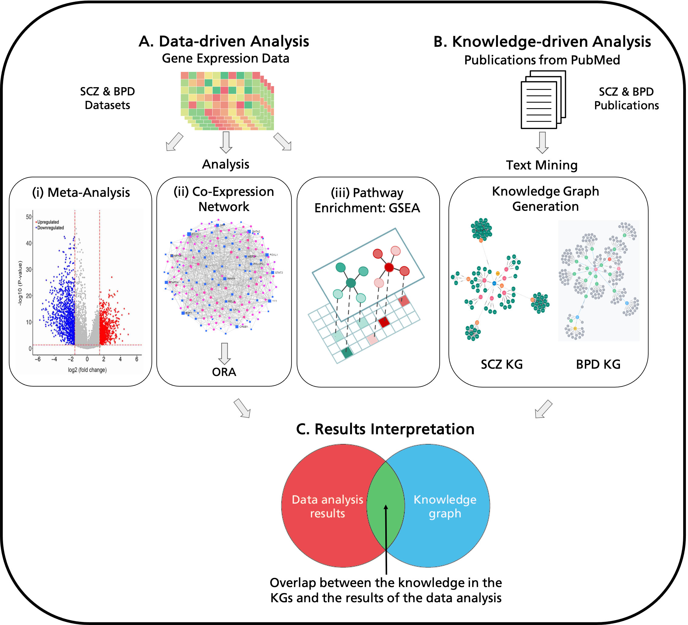

## Integrative analysis to identify shared mechanisms between schizophrenia and bipolar disorder and their comorbidities

## Table of Contents

* [General Info](#general-info)
* [Datasets](#datasets)
* [Knowledge Graphs](#knowledge-graphs)
* [Analyses](#analyses)
  - [Data Pre-processing](#data-pre-processing)
  - [Meta-analysis](#meta-analysis)
  - [Co-expression Network Analysis](#co-expression-network-analysis)
  - [Pathway Enrichment](#pathway-enrichment)
  - [GWAS Analysis](#gwas-analysis)
* [Citation](#citation)

## General Info
This repository contains code and data for our paper, "Integrative analysis to identify shared mechanisms between schizophrenia and bipolar disorder and their comorbidities" (Bharadhwaj *et al.*, 2022), which systematically investigates association between psychiatric disorders such as schizophrenia and bipolar disorder and its comorbidities with the assitance of prior knowledge from literature in the form of knowledge graphs the as shown in the workflow below.

  

## Datasets

### Schizophrenia Datasets
| Dataset      | Patient Strata  (Schizophrenia - Control) | Sequencing Platform                            | Sample Type                    | Reference                                                                                                                                                                                                                                                                                                                                                                                                   |
|--------------|-------------------------------------------|------------------------------------------------|--------------------------------|-------------------------------------------------------------------------------------------------------------------------------------------------------------------------------------------------------------------------------------------------------------------------------------------------------------------------------------------------------------------------------------------------------------|
| E-GEOD-12649 | 35 - 34                                   | Affymetrix GeneChip Human Genome U133A         | Prefrontal Cortex              | Iwamoto, K., Bundo, M., and Kato, T. (2005). Altered expression of mitochondria-related genes in postmortem  brains of patients with bipolar disorder or schizophrenia, as revealed by large-scale DNA microarray analysis.  Human molecular genetics, 14(2), 241–253.                                                                                                                                      |
| E-GEOD-21138 | 30 - 29                                   | Affymetrix GeneChip Human Genome U133 Plus 2.0 | Prefrontal Cortex              | Narayan, S., Tang, B., Head, S. R., Gilmartin, T. J., Sutcliffe, J. G., et. al. (2008). Molecular profiles of  schizophrenia in the CNS at different stages of illness. Brain research, 1239, 235–248.                                                                                                                                                                                                      |
| E-GEOD-21935 | 23 - 19                                   | Affymetrix GeneChip Human Genome U133 Plus 2.0 | Superior Temporal Cortex       | Barnes, M. R., Huxley-Jones, J., Maycox, P. R., Lennon, M., Thornber, A., et. al. (2011). Transcription and pathway analysis of the superior temporal cortex and anterior prefrontal cortex in schizophrenia. Journal of neuroscience research, 89(8), 1218–1227.                                                                                                                                           |
| E-GEOD-53987 | 48 - 55                                   | Affymetrix GeneChip Human Genome U133 Plus 2.0 | Hippocampus                    | Lanz, T. A., Reinhart, V., Sheehan, M. J., Rizzo, S., Bove, S. E., et. al. (2019). Postmortem transcriptional profiling reveals widespread increase in inflammation in schizophrenia: a comparison of prefrontal cortex, striatum, and hippocampus among matched tetrads of controls with subjects diagnosed with schizophrenia, bipolar or major depressive disorder. Translational psychiatry, 9(1), 151. |
| GSE93987     | 102 - 106                                 | Affymetrix GeneChip HT Human Genome U133+      | Dorsolateral Prefrontal Cortex | Arion, D., Corradi, J. P., Tang, S., Datta, D., Boothe, F., et. al. (2015). Distinctive transcriptome alterations of prefrontal pyramidal neurons in schizophrenia and schizoaffective disorder. Molecular psychiatry, 20(11), 1397–1405.                                                                                                                                                                   |

### Bipolar Disorder Datasets
| Dataset      | Patient Strata (Bipolar - Control) | Sequencing Platform                            | Sample Type                    | Reference                                                                                                                                                                                                                                                                                                                                                                                                   |
|--------------|------------------------------------|------------------------------------------------|--------------------------------|-------------------------------------------------------------------------------------------------------------------------------------------------------------------------------------------------------------------------------------------------------------------------------------------------------------------------------------------------------------------------------------------------------------|
| E-GEOD-46449 | 49 - 39                            | Affymetrix GeneChip Human Genome U133 Plus 2.0 | Leukocytes from Whole Blood    | Clelland, C. L., Read, L. L., Panek, L. J., Nadrich, R. H., Bancroft, C., and Clelland, J. D. (2013). Utilization of never-medicated bipolar disorder patients towards development and validation of a peripheral biomarker profile. PloS one, 8(6), e69082.                                                                                                                                                |
| E-GEOD-5388  | 30 - 31                            | Affymetrix GeneChip Human Genome U133A         | Dorsolateral Prefrontal Cortex | Ryan, M. M., Lockstone, H. E., Huffaker, S. J., Wayland, M. T., Webster, M. J., and Bahn, S. (2006). Gene expression analysis of bipolar disorder reveals downregulation of the ubiquitin cycle and alterations in synaptic genes. Molecular psychiatry, 11(10), 965–978.                                                                                                                                   |
| E-GEOD-5392  | 71 - 11                            | Affymetrix GeneChip Human Genome U133A         | Dorsolateral Prefrontal Cortex | Ryan, M. M., Lockstone, H. E., Huffaker, S. J., Wayland, M. T., Webster, M. J., and Bahn, S. (2006). Gene expression analysis of bipolar disorder reveals downregulation of the ubiquitin cycle and alterations in synaptic genes. Molecular psychiatry, 11(10), 965–978.                                                                                                                                   |
| E-GEOD-53987 | 52 - 55                            | Affymetrix GeneChip Human Genome U133 Plus 2.0 | Hippocampus                    | Lanz, T. A., Reinhart, V., Sheehan, M. J., Rizzo, S., Bove, S. E., et. al. (2019). Postmortem transcriptional profiling reveals widespread increase in inflammation in schizophrenia: a comparison of prefrontal cortex, striatum, and hippocampus among matched tetrads of controls with subjects diagnosed with schizophrenia, bipolar or major depressive disorder. Translational psychiatry, 9(1), 151. |
| GSE12649     | 33 - 34                            | Affymetrix GeneChip Human Genome U133A         | Prefrontal Cortex              | Iwamoto, K., Bundo, M., and Kato, T. (2005). Altered expression of mitochondria-related genes in postmortem brains of patients with bipolar disorder or schizophrenia, as revealed by large-scale DNA microarray analysis. Human molecular genetics, 14(2), 241–253.                                                                                                                                        |

### T2DM Datasets
| Dataset  | Patient Strata (Diabetes - Control) | Sequencing Platform                            | Sample Type           | Reference                                                                                                                                                                                                                                                                                                                                                                                                                                                                               |
|----------|-------------------------------------|------------------------------------------------|-----------------------|-----------------------------------------------------------------------------------------------------------------------------------------------------------------------------------------------------------------------------------------------------------------------------------------------------------------------------------------------------------------------------------------------------------------------------------------------------------------------------------------|
| GSE13760 | 10 - 11                             | Affymetrix GeneChip Human Genome U133 Plus 2.0 | Arterial Tissue       | Cangemi, C., Skov, V., Poulsen, M. K., Funder, J., Twal, W. O., et. al. (2011). Fibulin-1 is a marker for arterial extracellular matrix alterations in type 2 diabetes. Clinical chemistry, 57(11), 1556–1565. Skov, V., Knudsen, S., Olesen, M., Hansen, M. L., and Rasmussen, L. M. (2012). Global gene expression profiling displays a network of dysregulated genes in non-atherosclerotic arterial tissue from patients with type 2 diabetes. Cardiovascular diabetology, 11, 15.  |
| GSE15653 | 13 - 5                              | Affymetrix GeneChip Human Genome U133A         | Liver                 | Pihlajamäki, J., Boes, T., Kim, E. Y., Dearie, F., Kim, B. W., et. al. (2009). Thyroid hormone-related regulation of gene expression in human fatty liver. The Journal of clinical endocrinology and metabolism, 94(9), 3521–3529.                                                                                                                                                                                                                                                      |
| GSE20966 | 10 - 10                             | Affymetrix GeneChip Human X3P Array            | Pancreatic Beta cells | Marselli, L., Thorne, J., Dahiya, S., Sgroi, D. C., Sharma, A., et. al. (2010). Gene expression profiles of Beta-cell enriched tissue obtained by laser capture microdissection from subjects with type 2 diabetes. PloS one, 5(7), e11499.                                                                                                                                                                                                                                             |
| GSE23343 | 10 - 7                              | Affymetrix GeneChip Human Genome U133 Plus 2.0 | Liver                 | Misu, H., Takamura, T., Takayama, H., Hayashi, H., Matsuzawa-Nagata, N., et. al. (2010). A liver-derived secretory protein, selenoprotein P, causes insulin resistance. Cell metabolism, 12(5), 483–495.                                                                                                                                                                                                                                                                                |
## Knowledge Graphs
The knowledge graphs (KGs) mentioned in the paper were manually curated using the publications mentioned in the [schizophrenia publication](List_of_Schizophrenia_Articles.tsv), [bipolar disorder publication](List_of_Bipolar-Disorder_Articles.tsv) and [T2DM publication](List_of_T2DM_Articles.tsv) files. The KGs were further extended using data mining carried out by Kairntech using the code present in [this notebook](analysis/notebooks/BEL2Graph.ipynb). The extended files can be found in the [Knowledge Graphs folder](Knowledge_Graphs).

## Analyses
### Data pre-processing
The datasets for each disease was downloaded and pre-processed using a [standardized R script](analysis/R_scripts/download_data.R). The datasets were normalized using RMA from oligo R library and the probes were annotated using the platform related annotation database. 

### Meta-analysis
Meta-analysis of the datasets was carried out using the [ipython notebook](analysis/notebooks/meta-analysis_using_R.ipynb). It was carried out using the MetaVolcanoR R library using the votecounting function. 

### Co-expression Network Analysis
The co-expression networks were built using WGCNA R library and the script can be found [here](analysis/R_scripts/genCoExp.R). Further analysis and pathway enrichment using over-representation analysis (ORA) on the networks were carried out using this [ipython notebooks](analysis/notebooks/co-exp_network_analysis.ipynb). The common genes between the pathways can be found in [this notebook](analysis/notebooks/Overlapping_gene_analysis.ipynb).

### Pathway Enrichment
GSEA based pathway enrichement was carried out using GSEAPy python library using the following [script](analysis/GSEA.py). The enriched pathways were further compared and analysed using [the GSEA analysis notebook](analysis/notebooks/gsea_analysis.ipynb). The pathways enrichment of the genes in the KGs was carried out using the code provided in the [KG ORA notebook](analysis/notebooks/KG_ORA.ipynb)

### GWAS Analysis
The GWAS analysis was carried out on the files present in the [GWAS analysis folder](analysis/gwas_analysis) using the code available in the [respective notebook](analysis/notebooks/GWAS_Analysis.ipynb).

## Citation

If you have found our study useful in your work, please consider citing:

Bharadhwaj, V. S., Mubeen, S., Sargsyan, A., Jose, G. M., Geissler, S., Hofmann-Apitius, M., Domingo-Fern ́andez, D., & Kodamullil, A. T. (2023). [Integrative analysis to identify shared mechanisms between schizophrenia and bipolar disorder and their comorbidities.](https://doi.org/10.1016/j.pnpbp.2022.110688) Progress in Neuro-Psychopharmacology and Biological Psychiatry, 122, 110688.
